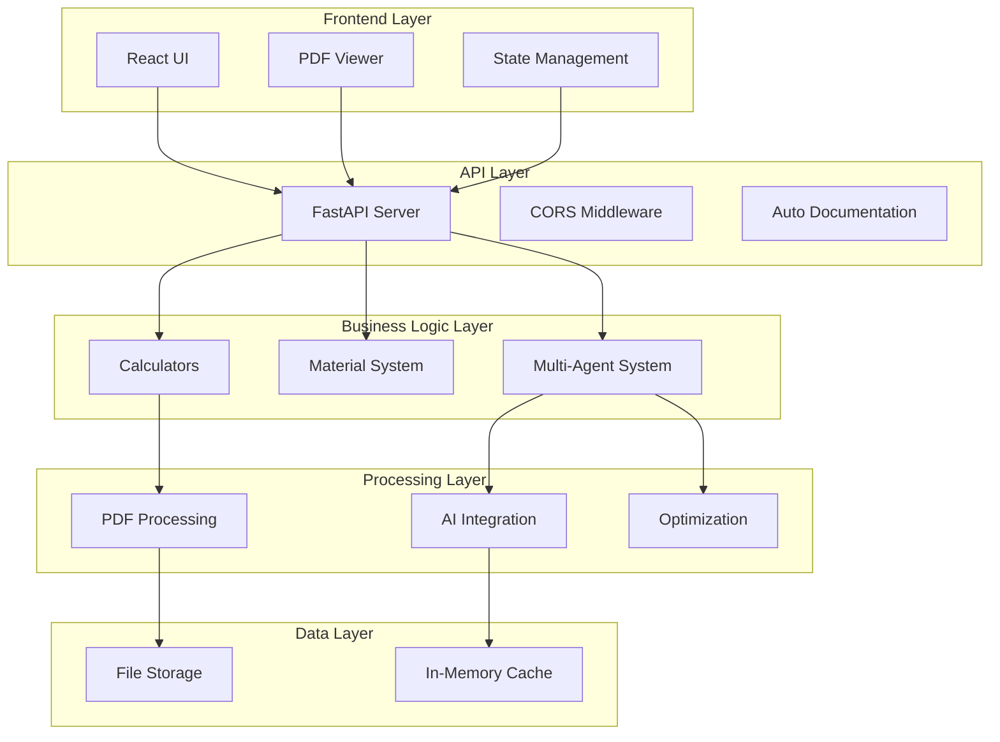

# System Architecture

CheckMeasureAI is built with a modern, scalable architecture designed for performance, maintainability, and extensibility.

## Overview



## Technology Stack

### Frontend
- **React 18** - Modern UI framework with hooks
- **TypeScript** - Type safety and developer experience
- **Ant Design** - Professional UI component library
- **PDF.js** - Client-side PDF rendering and interaction
- **Konva.js** - 2D canvas library for selection tools
- **Axios** - HTTP client for API communication
- **Zustand** - Lightweight state management

### Backend
- **FastAPI** - High-performance Python web framework
- **Python 3.11+** - Modern Python with async/await support
- **Pydantic** - Data validation and serialization
- **Uvicorn** - ASGI server for production deployment
- **AsyncIO** - Asynchronous programming for performance

### PDF Processing
- **PyMuPDF (fitz)** - PDF parsing and text extraction
- **OpenCV** - Computer vision for image processing
- **Tesseract OCR** - Optical character recognition
- **Pillow** - Image manipulation

### AI Integration
- **Claude AI** - Advanced language model for analysis
- **Multi-Agent Framework** - Distributed processing system
- **Event-Driven Architecture** - Asynchronous message passing

## Detailed Architecture

### Frontend Architecture

```
src/
├── components/
│   ├── pdf-viewer/           # PDF rendering and interaction
│   │   ├── SimplePDFViewer.tsx
│   │   └── SelectionOverlay.tsx
│   ├── agents/               # Multi-agent UI components
│   │   ├── AgentDashboard.tsx
│   │   └── AgentControlPanel.tsx
│   ├── calculation-review/   # Results display
│   │   └── SpecificationPanel.tsx
│   ├── CalculationPanel.tsx  # Input forms
│   └── ResultsDisplay.tsx    # Output formatting
├── utils/
│   └── api.ts               # API client with typed interfaces
├── types/
│   └── index.ts             # TypeScript type definitions
└── App.tsx                  # Main application component
```

#### Key Frontend Patterns
- **Component Composition** - Reusable, composable React components
- **Custom Hooks** - Shared logic for state management
- **Type Safety** - Full TypeScript coverage
- **Responsive Design** - Mobile-first approach
- **Error Boundaries** - Graceful error handling

### Backend Architecture

```
backend/
├── main.py                   # FastAPI application entry point
├── api/
│   └── routers/             # API endpoint organization
│       ├── calculations.py   # Calculation endpoints
│       ├── materials.py     # Material data endpoints
│       ├── pdf_processing.py # PDF handling endpoints
│       └── agents.py        # Multi-agent system endpoints
├── core/
│   ├── calculators/         # Business logic
│   │   └── joist_calculator.py
│   ├── materials/           # Material system
│   │   └── material_system.py
│   ├── agents/              # Multi-agent framework
│   │   ├── base_agent.py
│   │   ├── agent_manager.py
│   │   └── specialized/
│   └── optimization/        # Cutting optimization
├── pdf_processing/          # PDF analysis
│   ├── pdf_analyzer.py
│   └── advanced_analyzer.py
└── output_formats/          # Result formatting
    └── cutting_list_generator.py
```

#### Key Backend Patterns
- **Dependency Injection** - FastAPI's built-in DI system
- **Repository Pattern** - Data access abstraction
- **Factory Pattern** - Agent creation and management
- **Observer Pattern** - Event-driven multi-agent communication
- **Strategy Pattern** - Multiple calculation algorithms

### Multi-Agent System Architecture

```
Multi-Agent System
├── EventBus                 # Central message routing
├── AgentManager            # Agent lifecycle management
├── ProjectOrchestrator     # Task coordination
├── AgentRegistry          # Agent discovery
└── Specialized Agents
    ├── JoistCalculationAgent
    ├── CostAnalysisAgent (future)
    └── OptimizationAgent (future)
```

#### Agent Communication Flow
1. **Task Creation** - User submits calculation request
2. **Task Routing** - Orchestrator identifies required agents
3. **Agent Execution** - Specialized agents process tasks
4. **Result Aggregation** - Orchestrator combines results
5. **Response Delivery** - Enhanced results returned to user

### Data Flow

#### Traditional Calculation Flow
```
User Input → Validation → Calculator → Material Selection → Cutting List → Results
```

#### Multi-Agent Enhanced Flow
```
User Input → Task Creation → Agent Distribution → Parallel Processing → Result Enhancement → Aggregated Results
```

#### PDF Processing Flow
```
PDF Upload → Text Extraction → Pattern Recognition → Measurement Detection → Auto-Population
```

## Design Principles

### 1. Separation of Concerns
- **Frontend**: UI logic and user interaction
- **Backend**: Business logic and data processing
- **Agents**: Specialized calculation tasks

### 2. Scalability
- **Async Processing**: Non-blocking I/O operations
- **Modular Design**: Independent, replaceable components
- **Event-Driven**: Loose coupling between components

### 3. Maintainability
- **Type Safety**: TypeScript and Pydantic validation
- **Documentation**: Comprehensive API documentation
- **Testing**: Unit and integration tests

### 4. Extensibility
- **Plugin Architecture**: Easy addition of new calculators
- **Agent Framework**: Pluggable agent system
- **API Versioning**: Backward compatibility

## Performance Considerations

### Frontend Optimization
- **Code Splitting** - Lazy loading of components
- **Virtual Scrolling** - Efficient rendering of large lists
- **Memoization** - React.memo and useMemo optimizations
- **Bundle Analysis** - Webpack bundle optimization

### Backend Optimization
- **Async/Await** - Non-blocking request handling
- **Connection Pooling** - Efficient database connections
- **Caching** - In-memory caching of frequent calculations
- **Background Tasks** - Celery for long-running operations

### PDF Processing Optimization
- **Streaming** - Progressive loading of large files
- **Caching** - Processed results caching
- **Lazy Loading** - On-demand page rendering
- **Worker Processes** - Parallel PDF processing

## Security Considerations

### Current Implementation
- **Input Validation** - Pydantic models for all inputs
- **CORS Configuration** - Controlled cross-origin access
- **File Upload Limits** - Size and type restrictions

### Future Enhancements
- **Authentication** - JWT-based user authentication
- **Rate Limiting** - API usage controls
- **Input Sanitization** - SQL injection prevention
- **Audit Logging** - Security event tracking

## Deployment Architecture

### Development
```
Frontend (localhost:3000) ↔ Backend (localhost:8000)
```

### Production
```
CDN → Load Balancer → Frontend (Static Hosting)
                   ↓
API Gateway → Backend Instances → Database
           ↓
Multi-Agent Workers → Message Queue
```

## Monitoring and Observability

### Logging
- **Structured Logging** - JSON format for log aggregation
- **Log Levels** - DEBUG, INFO, WARNING, ERROR
- **Correlation IDs** - Request tracing across services

### Metrics
- **Performance Metrics** - Response times, throughput
- **Business Metrics** - Calculation success rates
- **System Metrics** - CPU, memory, disk usage

### Error Tracking
- **Exception Handling** - Comprehensive error catching
- **Error Reporting** - Structured error responses
- **Alerting** - Critical error notifications

## Future Architecture Enhancements

### Planned Improvements
1. **Microservices** - Service decomposition
2. **Event Sourcing** - Audit trail and replay capability
3. **CQRS** - Command/Query separation
4. **GraphQL** - Flexible API queries
5. **WebSocket** - Real-time updates
6. **Container Orchestration** - Kubernetes deployment

### Scalability Roadmap
1. **Horizontal Scaling** - Load balancer configuration
2. **Database Clustering** - Multi-master setup
3. **Caching Layer** - Redis/Memcached integration
4. **CDN Integration** - Global content delivery
5. **Auto-scaling** - Dynamic resource allocation